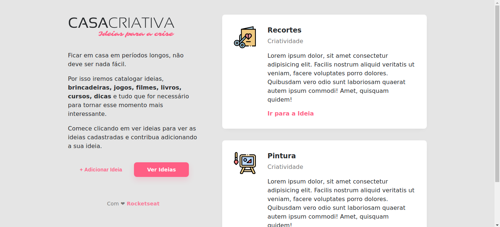

<h1 align="center">
    
</h1>

<h2 align="center">
  WorkshopDev - RocketSeat
</h2>

  

  
  
  

  

  

  <a href="#about">About</a>&nbsp;&nbsp;&nbsp;|&nbsp;&nbsp;&nbsp;
  <a href="#installing-the-application">Installing</a>&nbsp;&nbsp;&nbsp;|&nbsp;&nbsp;&nbsp;
  <a href="#running-the-application">Running</a>&nbsp;&nbsp;&nbsp;|&nbsp;&nbsp;&nbsp;
  <!--<a href="#testing">Testing</a>&nbsp;&nbsp;&nbsp;|&nbsp;&nbsp;&nbsp; -->
  <a href="#built-with">Built with</a>&nbsp;&nbsp;&nbsp;|&nbsp;&nbsp;&nbsp;
  <!--<a href="#layout">Layout</a>&nbsp;&nbsp;&nbsp;|&nbsp;&nbsp;&nbsp;-->
  <a href="#contributing">Contributing</a>&nbsp;&nbsp;&nbsp;|&nbsp;&nbsp;&nbsp;
  <a href="#license">License</a>

 

  

## About

A project developed during the WorkshopDev by RocketSeat: a simple platform for sharing ideas to do at home during times of quarentine.

## Installing the application

In order to install the application dependencies, after dowloading or branching you should run the terminal code `npm install` in the root folder.

## Running the application

Run the terminal code `npm run dev` or `npm run start` in the root folder.

<!--
## Testing

All tests can be run using <strong>supertest</strong> with the following line in terminal: `npm test` 

So far there are two tests:

Back end:
* ong.spec
* generateUniqueId.spec
-->

## Built with

* [Node.js](https://nodejs.org/en/)
* [Nodemon](https://www.npmjs.com/package/nodemon)
* [Nunjucks](https://mozilla.github.io/nunjucks/)

<!--
## Layout

 You can download the layout (`.sketch`) using [this link](.github/DevRadar.sketch).

To open it in any SO, use [Figma](https://figma.com).
-->

## Contributing

* Fork this repository;
* Create a branch with your feature: `git checkout -b my-feature`;
* Commit your changes: `git commit -m 'feat: My new feature: <description>'`;
* Push it to your branch: `git push origin my-feature`.

After merging your pull request, your branch can be deleted;

## License

This project uses the MIT license. Read [LICENSE](LICENSE.txt) for details.
